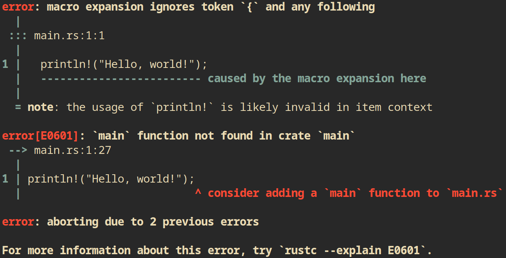
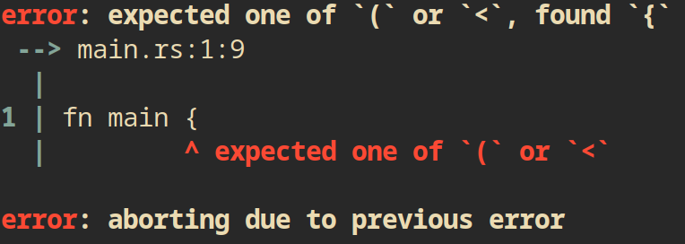

# Chapter 1 - Getting Started

### Section 1.1: Installation

#### Installation

Installation is discussed in the root README. 

I can verify that the installation was successful by checking the installed version of `rustc` by running:

```sh
$ rustc --version
```

This results in:

```
rustc 1.66.1 (90743e729 2023-01-10)
```

#### Upgrading rust

I can upgrade rust using the `rustup` component:

```sh
rustup update
```

#### Uninstalling rust

Rust and all its components can be removed from the system using the `rustup` utility.

```sh
rustup self uninstall
```

#### Documentation

I can view rust documentation which is installed along with rust as part of the `rustup` component.

```sh
rustup doc
```

This opens up the documentation as a website.

### Section 1.2: Hello, World!

Every programming tutorial should start with a "hello world" script. This is no different. 

The idea of this exercise is to utilise the compiler and understand the idea of an *ahead-of-time* compiled language, such as rust.

The files for this exercise are in the sub-directory `hello_world`.

#### The code

I created a file called `main.rs` with contents:


```rs
fn main() {
    println!("Hello, world!");
}
```

Then I ran

```sh
$ rustc main.rs
$ ./main
```

Which printed `Hello, world!` as expected. The `rustc` command compiled the code and created the binary `main` which could then be run. 

Let's have a look at the structure of the code and experiment to see what errors we get.

##### Semi-colon

Notice first that each line within the `main` function required a semi-colon at the end. Let's see what happens if we remove that and try to re-compile.

I am able to compile the program with no errors. Similarly it runs fine. Running `diff` against a copy of the original compiled result shows no difference. Let's see what happens with an additional `println` statement to see if the `;` is required in this case.

If we do not include the `;` at the end of each line we now get the following error:


So it is clear that semi-colons are required for rust commands as end points of each command.

##### Function name

In the code I used `main` as the function name. Let's now see if the compiler will allow me to rename the function. What happens if it is not called `main`?

We get an error:


We can alternatively call our new function in a function named `main`:

```rs
fn sillyname() {
    println!("Hello, world!");
}

fn main() {
    sillyname();
}
```

This is successful.

What happens if we don't have a function at all?

```rs
println!("Hello, world!");
```



It appears that a `main` function is required.

##### No `!` on `println!`

Let's try this two ways. First removing `!` whilst inside the `main` function:

```rs
fn main() {
    println("Hello, world!")
}
```

On compilation this results in the following error:


If we simply try to compile 

```rs
println("Hello, world!")
```

We get two errors, one for the lack of `main` function and another for the unknown function error.


This is all because `println!` is a macro (specified by the `!`). Excluding the `!` it would be a normal function, however there is no standard function called `println`.

##### Filename

I named the file `main.rs` and it had a `main` function. Let's see what happens if I rename the file.

Creating a copy of `main.rs` as `sillyname.rs` and compiling resulted in a new binary named `sillyname` that ran as expected. 

I additionally tried renaming `main` to `sillyname` in `sillyname.rs` but compilation failed because `main` is required.

##### Curly braces

The written function is in multi-line format. Can we write a single line and exclude the `{}`?

```rs
fn main() println!("Hello, world!");
```

This results in an error. Adding an `=` between `main()` and `println!` also errors. 

I can write a single line function if I include the curly braces:

```rs
fn main() { println!("Hello, world!"); }
```

I also need to have parens on `main`, i.e.:

```rs
fn main {
    println!("Hello, world!");
}
```

Results in:

o

#### `rustc`

The `rustc` compiler must be ran on the rust file to generate a binary before I can actually run the code. The `rustc` compiler is fine for small programs, but I may wish to look at other tools for real world code and for easier sharing.

### Hello, Cargo!

Cargo is the main build system and dependency manager for rust. Most real world projects utilise `cargo` for project management. 

```sh
$ cargo --version
```

```
cargo 1.66.1 (ad779e08b 2023-01-10)
```

#### Creating a Cargo project

We create a new project using the command

```sh
$ cargo new hello_cargo
```

Where we can replace `hello_cargo` with our project name. This creates a new project with directory structure:

```
  .
 └──  hello_cargo
    ├──  src
    │  └──  main.rs
    └──  Cargo.toml
```

The `toml` file is used to tell Cargo what dependencies the project requires. This is similar to `Julia`s package management system.

```toml
[package]
name = "hello_cargo"
version = "0.1.0"
edition = "2021"

# See more keys and their definitions at https://doc.rust-lang.org/cargo/reference/manifest.html

[dependencies]
```

By default the file `./scr/main.rs` is a basic Hello, world script

```rs
fn main() {
    println!("Hello, world!");
}
```

It also automatically initialises git in the project. There are additional options to `cargo new`, for example we can ignore version control by adding the `--vcs none` tag.

For the majority of exercises within this learning project I will be ignoring version control as the entire set of notes and codes will be in one repo. I will ensure that no binaries are stored in the repo. 

#### Building a Cargo project

To build the project we simply run 

```sh
$ cargo build
   Compiling hello_cargo v0.1.0 (learning_rust/1_Getting_Started/hello_cargo)
    Finished dev [unoptimized + debuginfo] target(s) in 0.36s
```

This adds new files

```
  .
 ├──  .git
 ├──  src
 │  └──  main.rs
 ├──  target
 │  ├──  debug
 │  │  ├──  .fingerprint
 │  │  ├──  build
 │  │  ├──  deps
 │  │  ├──  examples
 │  │  ├──  incremental
 │  │  ├──  .cargo-lock
 │  │  ├──  hello_cargo
 │  │  └──  hello_cargo.d
 │  ├──  .rustc_info.json
 │  └──  CACHEDIR.TAG
 ├──  .gitignore
 ├──  Cargo.lock
 ├──  Cargo.toml
 └──  out.txt
```

The compiled binary is `./target/debug/hello_cargo`.

#### Running a Cargo Project

We use `cargo run`

```sh
$ cargo run
    Finished dev [unoptimized + debuginfo] target(s) in 0.00s
     Running `target/debug/hello_cargo`
Hello, world!
```

We can actually run `cargo run` in place of `cargo build`. 

If we don't wish to build a binary yet, we can check that our code is able to be compiled by running:

```
$ cargo check
    Checking hello_cargo v0.1.0 (learning_rust/1_Getting_Started/hello_cargo)
    Finished dev [unoptimized + debuginfo] target(s) in 0.08s
```

### Releasing a project

Note that the binary is located in a directory `debug`. When we are actually ready to release or deploy our project we can add the `--release` tag to the `build` command:

```sh
$ cargo build --release
   Compiling hello_cargo v0.1.0 (learning_rust/1_Getting_Started/hello_cargo)
    Finished release [optimized] target(s) in 0.33s
```

With directory structure:

```
  .
 ├──  src
 │  └──  main.rs
 ├──  target
 │  ├──  release
 │  │  ├──  build
 │  │  ├──  deps
 │  │  ├──  examples
 │  │  ├──  incremental
 │  │  ├──  hello_cargo
 │  │  └──  hello_cargo.d
 │  └──  CACHEDIR.TAG
 ├──  Cargo.lock
 └──  Cargo.toml
```
